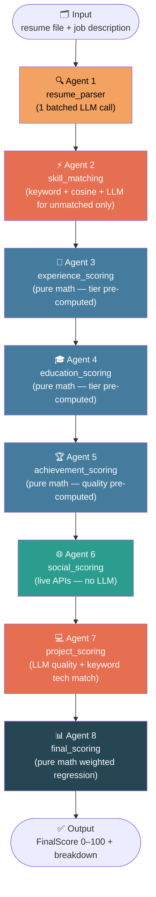

# Resumi — AI-Powered Resume Scoring System

An intelligent resume scoring pipeline built with **LangGraph**, **Groq LLaMA 3.3**, and **scikit-learn**. It evaluates a candidate's resume against a job description across 8 dimensions and produces a weighted score out of 100.

---

## Architecture Overview

The system is a directed **LangGraph pipeline** with 8 sequential agent nodes. Each node reads from and writes to a shared `ResumeGraphState`.



---

## LLM Call Optimisation

A key design goal is **minimising LLM calls**. The previous version made 4–6 LLM calls per resume. The current version makes at most **2–3 calls** (often just 1–2):

| Agent | LLM Calls (Old) | LLM Calls (New) | Method |
|---|---|---|---|
| resume_parser | 1 | **1 (batched)** | Extracts resume + classifies all tiers + achievement quality in one call |
| skill_matching | 1 (all unmatched) | **0–1** (only truly unmatched) | Exact + cosine first; LLM only for remaining gaps |
| experience_scoring | 1 per company | **0** | Company tier pre-computed by parser |
| education_scoring | 1 per institution | **0** | Institution tier pre-computed by parser |
| achievement_scoring | 1 | **0** | Quality score pre-computed by parser |
| social_scoring | 0 | **0** | Live APIs only |
| project_scoring | 0 (didn't exist) | **1** | LLM rates project quality |
| final_scoring | 1 (semantic LLM) | **0** | TF-IDF cosine similarity |

**Result: ~5–7 LLM calls reduced to 2–3.**

---

## Agent Nodes — Detailed Explanation

### Agent 1 — `resume_parser`

**Purpose:** Extract structured data from raw resume text.

**What it does:**
1. Extracts text from PDF/DOCX using `utils/file_parser.py`.
2. Makes **one batched LLM call** that simultaneously:
   - Parses all resume fields (personal info, skills, experience, education, projects, achievements, certifications)
   - Classifies each **company** into tier 1/2/3
   - Classifies each **educational institution** into tier 1/2/3
   - Rates overall **achievement quality** (0–10)
3. Validates and sanitizes all output via Pydantic + regex fallbacks.

**Pre-computed tiers (eliminates downstream LLM calls):**
- `experience[i].company_tier` — 1/2/3
- `education[i].institution_tier` — 1/2/3
- `achievement_quality_score` — float 0–10

---

### Agent 2 — `skill_matching`

**Purpose:** Score how well the candidate's skills match the job requirements.

**Layers (3-layer hybrid):**

| Layer | Method | What it handles |
|---|---|---|
| L1 — Exact/Normalized | Keyword matching (lowercase, strip punctuation) | `React.js` ↔ `ReactJS`, `Node JS` ↔ `NodeJS` |
| L2 — Cosine Similarity | TF-IDF char n-gram cosine | Partial name overlaps, abbreviations |
| L3 — LLM Semantic | Groq LLM (only unmatched skills) | `Express.js` ↔ `ExpressJS`, deep synonyms |

**Optimisation:** Already-matched skills from L1+L2 are **not sent to the LLM**. Only truly unmatched required skills and unmatched resume skills are passed to L3. This drastically reduces token usage.

**Score guarantees:**
- All required skills matched → score **≥ 9.0 / 10**
- All required matched + extra relevant skills → score up to **10.0 / 10**
- Partial match → proportional 0–8.9

---

### Agent 3 — `experience_scoring`

**Purpose:** Score work experience quality and relevance.

**Components:**

| Component | Weight | Method |
|---|---|---|
| Years of experience | 40% (job) / 25% (internship) | Date parsing math |
| Company tier | 35% | Pre-computed by parser (Tier 1=10, Tier 2=6.5, Tier 3=3.5) |
| Role relevance | 25% (job) / 40% (internship) | TF-IDF cosine vs job description |

**Company tier levels:**
- **Tier 1 (10.0):** FAANG — Google, Microsoft, Amazon, Meta, Apple, Netflix, Uber, etc.
- **Tier 2 (6.5):** Well-known tech — Razorpay, Zomato, Flipkart, Freshworks, Postman, etc.
- **Tier 3 (3.5):** Small/local/unknown companies, agencies, freelance

**Internship mode:** No-experience penalty waived; role relevance weighted higher.

---

### Agent 4 — `education_scoring`

**Purpose:** Score academic qualifications and their relevance.

**Components:**

| Component | Weight | Method |
|---|---|---|
| Degree level | 35% | Rule-based level map; penalised if below requirement |
| Institution tier | 30% | Pre-computed by parser |
| Field relevance | 20% | TF-IDF cosine + CS/AI keyword bonus |
| GPA | 15% | Multi-scale normalisation (4-point, 10-point, %) |

**Degree level mapping:**
- PhD / Doctorate → 10.0
- M.Tech / M.S. / MBA → 8.5
- B.Tech / B.E. / B.S. → 7.0
- Diploma / Associate → 5.0
- High School / 12th → 3.0

**Institution tier levels:**
- **Tier 1 (10.0):** IITs, IISc, NITs (top), BITS Pilani, MIT, Stanford, CMU, Oxford, Cambridge, etc.
- **Tier 2 (6.5):** VIT, Manipal, SRM, NMIMS, Nirma, DAIICT, PDEU, CHARUSAT, GTU-affiliated, NAAC A/A+
- **Tier 3 (3.5):** Unknown/local/unaccredited colleges, high schools

---

### Agent 5 — `achievement_scoring`

**Purpose:** Score achievements, certifications, and competitive programming performance.

**Components:**

| Component | Weight | Method |
|---|---|---|
| Count & diversity | 30% | Rule-based count across achievements + certs + projects |
| Achievement quality | 40% | Pre-computed by parser (no extra LLM call) |
| Certification quality | 15% | Keyword matching against known cert list |
| Projects as achievements | 15% | Count + tech stack depth |

**Achievement quality levels (set by parser):**
- 9–10: World-class (ICPC world finalist, Codeforces 2300+, IOI)
- 7–8: Excellent (ICPC regional, hackathon win, AWS/GCP cert, Codeforces Expert)
- 5–6: Good (LeetCode top 5–10%, recognised hackathon participant)
- 3–4: Average (moderate LeetCode, basic certs)
- 1–2: Low activity
- 0: Nothing notable

---

### Agent 6 — `social_scoring`

**Purpose:** Score online presence on GitHub, LeetCode, and Codeforces using **live public APIs**.

No LLM involved — all data from API responses.

**GitHub scoring (relaxed thresholds):**
- repos_score = `clamp(repos / 10, 0, 1) × 10` — 10 repos = max
- stars_score = `clamp(stars / 20, 0, 1) × 10` — 20 stars = max
- followers_score = `clamp(followers / 30, 0, 1) × 10` — 30 followers = max
- Final = `0.5×repos + 0.3×stars + 0.2×followers`
- Floor: any profile with repos → minimum 3.0

**LeetCode scoring (relaxed thresholds):**
- solved_score = `clamp(solved / 100, 0, 1) × 10` — 100 problems = max
- hard_score = `clamp(hard / 20, 0, 1) × 10` — 20 hard = max
- rank_score = `clamp(1 - rank/200000, 0, 1) × 10`
- Floor: any solved → minimum 3.0

**Codeforces scoring (rating bands):**

| Rating | Score | Title |
|---|---|---|
| 2300+ | 10.0 | Grandmaster+ |
| 2100–2299 | 9.0 | Master |
| 1900–2099 | 8.0 | Candidate Master |
| 1600–1899 | 7.0 | Expert |
| 1400–1599 | 5.5 | Specialist |
| 1200–1399 | 4.0 | Pupil |
| < 1200 | 2.0 | Newbie |

If a platform URL is missing, it is excluded from the weighted average (not penalised).

---

### Agent 7 — `project_scoring` *(New)*

**Purpose:** Score the candidate's projects both for quality and for practical skill application.

**Dimension 1 — Project Quality (LLM):**
The LLM evaluates each project considering:
- Complexity (simple CRUD vs distributed system)
- Technical depth (tutorial clone vs original architecture)
- Deployment / production usage
- Domain relevance to the job role

**Dimension 2 — Skill Match in Projects (keyword, no LLM):**
Checks how many **required skills** actually appear in project technology stacks.
A skill listed on a resume is one thing; a skill *used in a project* is stronger evidence.

**Score formula:**
```
project_score = 0.55 × quality_score + 0.45 × tech_match_score
```

**Why this matters:** A candidate who lists 10 skills but uses 0 in actual projects is less credible than one who uses 7 in real work. This agent surfaces that signal.

---

### Agent 8 — `final_scoring`

**Purpose:** Aggregate all component scores into a final weighted score 0–100.

**No LLM calls.** Semantic fit is computed via **TF-IDF cosine similarity** between resume text and job description.

**Weights:**

| Component | Job Weight | Internship Weight |
|---|---|---|
| Skill matching | 25% | 30% |
| Experience | 20% | 8% |
| Projects | 15% | 20% |
| Education | 13% | 15% |
| Achievements | 12% | 15% |
| Social profiles | 10% | 7% |
| Semantic (cosine) | 5% | 5% |

**Formula:**
```
total_score = clamp(Σ(weight_i × score_i) × 10, 0, 100)
```

**Score labels:**

| Range | Label |
|---|---|
| 90–100 | Exceptional Match 🏆 |
| 75–89 | Strong Match ✅ |
| 60–74 | Good Match 👍 |
| 45–59 | Moderate Match ⚠️ |
| 30–44 | Weak Match 📉 |
| 0–29 | Poor Match ❌ |

---

## Project Structure

```
resumi/
├── main.py                          # FastAPI entry point
├── requirements.txt
├── .env.example
│
├── agents/
│   ├── resume_parser_agent.py       # Agent 1 — parse + batch classify
│   ├── skill_matching_agent.py      # Agent 2 — 3-layer skill matching
│   ├── experience_scoring_agent.py  # Agent 3 — years + tier + relevance
│   ├── education_scoring_agent.py   # Agent 4 — degree + tier + GPA
│   ├── achievement_scoring_agent.py # Agent 5 — count + quality + certs
│   ├── social_agent.py              # Agent 6 — GitHub/LeetCode/CF APIs
│   ├── project_scoring_agent.py     # Agent 7 (NEW) — project quality + skill usage
│   └── final_scoring_agent.py       # Agent 8 — pure math weighted regression
│
├── graph/
│   └── pipeline.py                  # LangGraph StateGraph definition
│
├── models/
│   └── state.py                     # Pydantic models + ResumeGraphState TypedDict
│
├── utils/
│   ├── file_parser.py               # PDF/DOCX text extraction
│   ├── logger.py                    # Structured logging helpers
│   └── validators.py                # JSON parsing, sanitization, URL validation
│
└── frontend/
    └── index.html                   # Single-page UI
```

---

## Setup

```bash
# 1. Clone and install
pip install -r requirements.txt

# 2. Configure environment
cp .env.example .env
# Edit .env and set GROQ_API_KEY

# 3. Run
python main.py
# Open http://localhost:8000
```

### Environment Variables

| Variable | Default | Description |
|---|---|---|
| `GROQ_API_KEY` | *(required)* | Groq API key for LLaMA 3.3 |
| `GROQ_MODEL` | `llama-3.3-70b-versatile` | Groq model ID |
| `PORT` | `8000` | FastAPI server port |

---

## Scoring Philosophy

- **No black-box LLM scores.** Every final number is traceable to a formula with explicit weights.
- **LLM for classification, math for aggregation.** LLMs are only used where rule-based approaches genuinely fail (tier classification, project quality, semantic skill matching).
- **Fail-safe defaults.** If any agent fails, scores default to 3.0/10 (below-average neutral) rather than crashing the pipeline.
- **Fair to good profiles.** Social scoring thresholds are calibrated for real-world developers, not top 1% unicorns. A developer with 10 repos and 100 LeetCode solves should score reasonably well.
- **Skills matched = used.** Project scoring separately measures whether required skills appear in actual project tech stacks — a stronger signal than just listing them.
